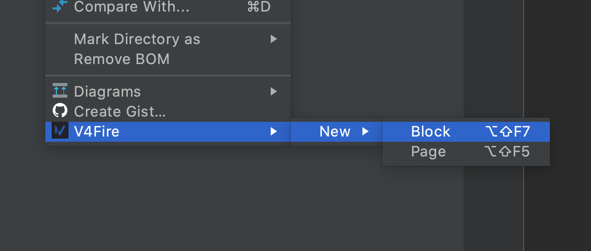

# V4Fire Idea IDE plugin

Plugin for comfortable work with [v4fire-cli](https://github.com/V4Fire/cli) 
in intellij idea IDEs (WebStorm, PHPStorm etc)

> Need install  `v4fire-cli` before work

```bash
yarn add v4fire-cli
```





